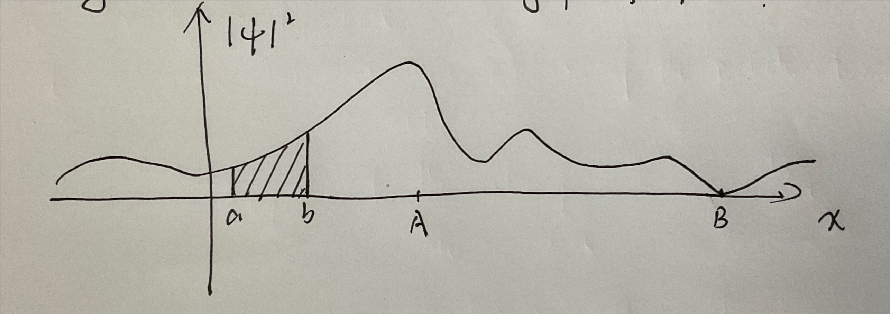
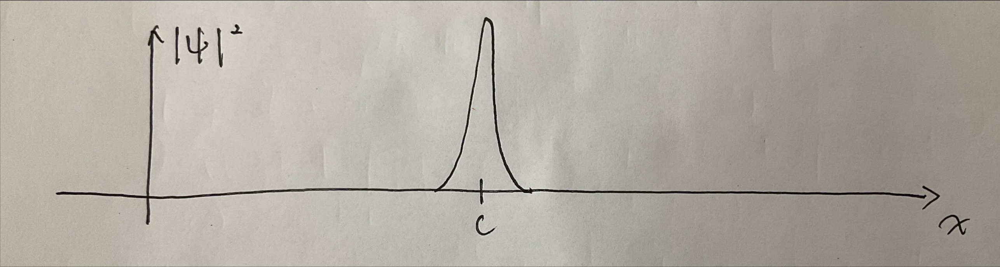

# The Wave Function

## 1.1 The Schrodinger Equation

***`Classical mechanics`*** determine the position of the particle at any given time: $x(t)$

* figure out the velocity: $v={{ dx } / { dt }}$
* figure out the momentum: $p=mv$
* figure out the kinetic energy: $T=\frac{1}{2}mv^2$
* figure out any other dynamical variable of interest

==How== Newton’s second law:
$$
F=ma
\\
=m\frac{d^2x}{dt^2}
$$
And according to the conservation $F=-{{ \partial V } / { \partial x }}$.

> With appropriate initial conditions (typically at $t=0$).

***`Quantum mechanics`*** looking for particle’s wave function: $\mathrm{\psi}\left( x,t \right)$

Solving the Schrodinger equation:
$$
i\hbar \frac{\partial \psi}{\partial t}=-\frac{\hbar^2}{2m}\frac{\partial^2\psi}{\partial x^2}+V\psi
$$
Here $\hbar=\frac{h}{2\pi}=1.054573\times10^-34 J\cdot s$. ($h$: Plank’s constant)

* Need to give suitable initial conditions (typically $\psi(x,0)$)
* The Schrodinger equation determines $\psi(x,t)$ for all future time.

## 1.2 The Statistical Interpretation

Born’s statistical interpretation, $\left| \psi \left( x,t \right) \right|^2$, gives the probability of finding the particle at point $x$, at time $t$ — or, more precisely.
$$
\int_a^b{\left| \psi \left( x,t \right) \right|^2dx=\left\{ \begin{array}{c}
	probability\,\,of\,\,finding\,\,the\,\,particle\\
	between\,\,a\,\,and\,\,b, at\,\,time\,\,t\\
\end{array} \right\}}
$$
Probability is the `area` under the graph of $\left| \psi \right|^2$.

The shaded area represents the probability of finding the particle between *a* and *b*.

The satisfied interpretation introduces a kind of *indeterminacy*:

1. The `realist position`. The particle was at $C$ before it was found at point $C$. Einstein’s view. If this thought is true, quantum mechanics is an incomplete theory because the position of the particle is determined but quantum mechanics can’t tell us. Evidently, we can’t get all information according to $\psi$, additional information (a hidden variable) is needed.
2. The `orthodox position`. The particle wasn’t really anywhere. The action of *measurement* forced it to appear at point $C$ (don’t need to care about how and why it appeared at point $C$). Observations not only disturb what is to be measured, they produce it. We ‘compel’ [the particle] to assume a definite position (spoken by Joran). This view is called `Copenhagen interpretation`.
3. The `agnostic position`. You can’t get the status of a particle before the measurement. It’s useless to worry about something that can’t be tested.

All three positions used to have their partisans. But in 1964, John Bell proved that the agnostic position was false. There is observable difference whether the particle has a precise (though unknown) position prior to measurement, or not. For now, the orthodox position had been proved true. A particle simply does not have a precise position prior to measurement,. It is the measurement process acting on a particular particle and creating a specific result, limited only by the statistical weighting imposed by wave function.

When there’s a second measurement immediately after the first one, it will return the same value, but it can’t prove the realist position. The  first measurement radically alters the wave function, and the wave function collapses, upon measurement, to a spike at the point $C$ . The collapse is not eternal, it will soon spread again.

## 1.3 Probability

### Discrete variables

For example, if we let $N(j)$ represent the number of people of age j, then the total number of people in the room is
$$
N=\sum_{j=0}^{\infty}{N\left( j \right)}
$$
Here, we set

| $N(j)$  | num  |
| :-----: | :--: |
| $N(14)$ |  1   |
| $N(15)$ |  1   |
| $N(16)$ |  3   |
| $N(22)$ |  2   |
| $N(24)$ |  2   |
| $N(25)$ |  5   |

Of course, $N = 14$. If we select an individual whose age is 15, the probability $P\left( 15 \right) = \frac{1}{14}$. $P(j)$ is the probability of getting $j$.

In general:
$$
P(j) = \frac{N(j)}{N}
$$
`The most probable age` the most probable $j$ is the $j$ for which $P(j)$ is a maximum.

`The median age` the median age is that value of $j$ such that the probability of getting a larger or equal result is the same as the probability of getting a smaller or equal result.

`The average (or mean) age` $\left< j \right> =\frac{\sum{jN\left( j \right)}}{N}=\sum_{j=0}^{\infty}{jP\left( j \right)}$

In the quantum mechanics, the average is usually the quantity of interest; in that context it has come to be called the `expectation value`.

`The average of squares of the ages` $\left< j^2 \right> =\sum_{j=0}^{\infty}{j^2P\left( j \right)}$

`The average value of some function of j` $\left< f\left( j \right) \right> =\sum_{j=0}^{\infty}{f\left( j \right) P\left( j \right)}$

==Notice== $\left< j^2 \right> \ne \left< j \right> ^2$. For instance, if the room contains just two babies, aged 1 and 3, then $\left< j^2 \right> =5$, but $\left< j \right> ^2=4$.

`The variance of the distribution` $\sigma ^2\equiv \left< \left( \Delta j \right) ^2 \right> $

`Standard deviation` $\sigma =\sqrt{\left< \left( \Delta j \right) ^2 \right>}$

$\sigma^2$ and $\sigma$ can show the amount of “spread” in a distribution, with respect to the average.

And here is a useful little theorem on variances:
$$
\sigma ^2=\left< \left( \Delta j \right) ^2 \right> 
\\
=\sum{\left( \Delta j \right) ^2P\left( j \right)}
\\
=\sum{\left( j-\left< j \right> \right) ^2P\left( j \right)}
\\
=\sum{\left( j^2-2j\left< j \right> +\left< j^2 \right> \right) P\left( j \right)}
\\
=\sum{j^2P\left( j \right) -2\left< j \right> \sum{jP\left( j \right) +\left< j \right> ^2\sum{P\left( j \right)}}}
\\
=\left< j^2 \right> -2\left< j \right> ^2+\left< j \right> ^2
\\
=\left< j^2 \right> -\left< j \right> ^2
$$
So, $\sigma = \sqrt{\left<j^2\right>-\left<j\right>^2}$. That is to say, the distributions have no spread at all.

### Continuous Variables

In the continuous distribution, the probability of a precise value lies in some interval.

If the interval is sufficiently short, the probability is *proportional* to the length of the interval.

Thus
$$
\left\{ \begin{array}{c}
	Probability\,\,that\,\,an\,\,individual\,\,\\
	\left( chosen\,\,at\,\,random \right) \,\,lies\,\,between\\
	x\,\,and\,\,\left( x+dx \right)\\
\end{array} \right\} =\rho \left( x \right) dx
$$
$\rho(x)$ is the proportionality factor, is often called “*the probability of getting x*”. 

However, a better name of $\rho(x)$ is “*probability density*”.

The probability that x lies between a and b (a infinite interval) is given by the integral of $\rho(x)$:
$$
P_ab = \int_a^b \rho(x)dx
$$
Thus we can get following terms:
$$
\int_{-\infty}^{+\infty}{\rho \left( x \right) dx=1}
\\
\left< x \right> =\int_{-\infty}^{+\infty}{x\rho \left( x \right) dx}
\\
\left< f\left( x \right) \right> =\int_{-\infty}^{+\infty}{f\left( x \right) \rho \left( x \right) dx}
\\
\sigma ^2\equiv \left< \left( \Delta x \right) ^2 \right> =\left< x^2 \right> -\left< x \right> ^2
$$
==Notice== a probability density can be infinite, though probability itself must be finite.

## 1.4 Normalization

